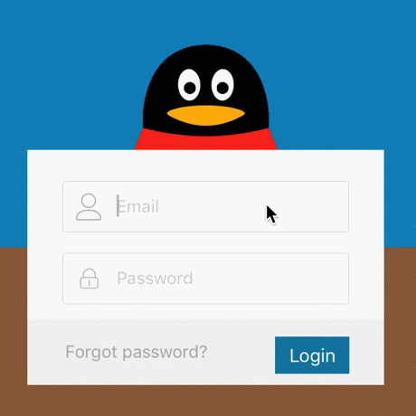

# FNAnimalLoginView
Swift登陆界面：猫头鹰蒙眼、企鹅闭眼、相片毛玻璃.

###基础使用Demo：

```
	let loginView = FNAnimalLoginView.init(frame: CGRectMake((view.frame.size.width-300)/2, 150, 300, 300))
	loginView.type = 2
	view.addSubview(loginView)
```

###效果：



